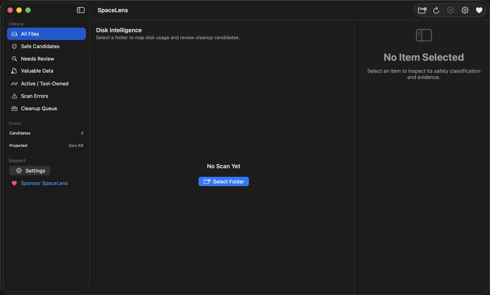

# SpaceLens

SpaceLens is a native, local-first macOS disk intelligence app. It scans a
folder you select, explains large disk consumers, classifies cleanup risk with
deterministic local rules, and lets you review exact paths before moving
cleanup-ready items to the Bin.



> **Release status:** SpaceLens 1.0 source is released under the MIT License.
> No signed public app or GitHub release asset exists yet; current Developer ID
> signing and notarization evidence remain external release gates. See
> [Open-source readiness](docs/OPEN_SOURCE_READINESS.md).

## What SpaceLens does

- Scans filesystem metadata with throttled, cancellable progress updates.
- Presents a responsive sidebar, sortable table, inspector, search, filters,
  multi-selection, and explicit cleanup queue.
- Classifies common caches, generated outputs, logs, protected paths, active
  tool-owned storage, and valuable user data with local rules.
- Enables cleanup only for cleanup-ready classifications and requires an
  exact-path confirmation before moving items to the Bin.
- Restores the last selected folder and cleanup queue with an app-scoped
  security bookmark stored locally.
- Sends no file contents or metadata to an external service and includes no
  analytics, advertising, or tracking SDK.

## Requirements

- macOS 14 or later
- Xcode 26.6
- Swift 6
- XcodeGen 2.45.4 when regenerating the Xcode project

There are no third-party Swift package dependencies.

## Build and test

```bash
swift test -Xswiftc -warnings-as-errors
./script/generate_xcode_project.sh
git diff --exit-code -- SpaceLens.xcodeproj
./script/build_and_run.sh --verify
```

For individual development builds:

```bash
swift build
swift build -c release
```

## Architecture

```text
SwiftUI views
    ↓
AppState and session state
    ↓
Scanner · rule engine · intelligence · cleanup services
    ↓
Selected filesystem scope and local Application Support state
```

Pure models and classification logic are separated from filesystem, Finder,
process, and persistence I/O. The Xcode project is generated from `project.yml`;
changes to the generated project must be reproducible from that source.

## Safety and privacy

SpaceLens does not expose permanent deletion in 1.0. Move to Bin is available
only for items classified as safe temporary data, rebuildable cache, or
generated output. The confirmation lists every target path, and cleanup rejects
changed identities, symlinks, unauthorized roots, and non-queueable data.

The app reads filesystem metadata only within a folder selected through the
macOS picker. Read the [privacy policy](docs/PRIVACY.md) and the documented
[limitations](docs/release/1.0/RELEASE_NOTES.md#known-limitations) before use.

## Distribution

Maintainers can build a source-bound Developer ID artifact from a clean commit:

```bash
SPACE_LENS_DEVELOPER_ID='Developer ID Application: Name (TEAMID)' \
  ./script/build_direct_download.sh
```

Apple notarization is a separate external upload. The finalizer submits the
pre-notarization ZIP, waits for acceptance, staples a copy of the app, validates
it, and creates a new ZIP from the stapled copy:

```bash
SPACE_LENS_NOTARY_PROFILE='SpaceLens-notary' \
SPACE_LENS_RELEASE_INPUT_DIR='/absolute/path/to/pre-notarization-artifacts' \
SPACE_LENS_NOTARIZED_OUTPUT_DIR='/absolute/path/to/final-artifacts' \
  ./script/notarize_direct_download.sh
```

The Mac App Store lane is independent:

```bash
./script/validate_app_store_readiness.sh
SPACE_LENS_DEVELOPMENT_TEAM=YOUR_TEAM_ID ./script/archive_app_store.sh
```

See [the release runbook](docs/RELEASING.md) and
[App Store guide](docs/APP_STORE.md). Never reuse an older signed artifact as
evidence for changed source.

## Project documentation

- [Contributing](CONTRIBUTING.md)
- [Code of Conduct](CODE_OF_CONDUCT.md)
- [Security reporting](SECURITY.md)
- [Support](SUPPORT.md)
- [Changelog](CHANGELOG.md)
- [Release status](docs/release/1.0/RELEASE_STATUS.md)
- [Production plan](docs/production-plan.md)

## License

SpaceLens source, bundled app icons, and repository screenshots are available
under the [MIT License](LICENSE). See [asset provenance](docs/ASSET_PROVENANCE.md)
for the reviewed binary-asset inventory.
