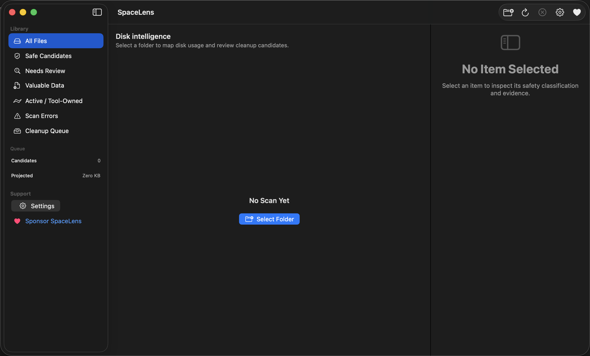

# SpaceLens

SpaceLens is a native, local-first macOS disk intelligence app. It scans a
folder you select, explains large disk consumers, classifies cleanup risk with
deterministic local rules, and lets you review exact paths before moving
cleanup-ready items to the Bin.



> **Release status:** SpaceLens is published under the Apache License 2.0.
> The [latest release](https://github.com/rsitech-ai/space_lens/releases/latest)
> provides a Developer ID-signed, Apple-notarized universal macOS download,
> checksums, and build provenance. See
> [Open-source readiness](docs/OPEN_SOURCE_READINESS.md).

## What SpaceLens does

- Scans filesystem metadata with throttled, cancellable progress updates.
- Presents a responsive sidebar, sortable table, inspector, search, filters,
  multi-selection, and explicit cleanup queue.
- Classifies common caches, generated outputs, logs, protected paths, active
  tool-owned storage, and valuable user data with local rules.
- Enables cleanup only for cleanup-ready classifications and requires an
  exact-path confirmation before moving items to the Bin.
- Restores the last selected folder and cleanup queue with an app-scoped
  security bookmark stored locally.
- Sends no file contents or metadata to an external service and includes no
  analytics, advertising, or tracking SDK.

Full-folder scans measure every accessible descendant while retaining at most
10,000 result nodes and 256 children per folder. Large scans show a bounded folder
overview; select a smaller folder for deeper file details. Cleanup estimates cover
the retained results. Smart Scan searches known cleanup locations independently of
this display budget. Traversal, application activity checks, safety classification,
and summary preparation each report their current phase. Stop cancels processing
as well as traversal.

Smart Scan first reports the number of filesystem locations checked while finding
cleanup candidates. Candidate sizing is a separate phase; discovery visits are
not counted again in the final measured-file totals.

Whole-drive scans skip the virtual `/.nofollow` and `/.resolve` kernel path namespaces; these can expose the same root tree again without being symbolic links. Both Full Scan and Smart Scan use canonical folders instead.

## Requirements

- macOS 14 or later
- Xcode 26.6
- Swift 6
- XcodeGen 2.45.4 when regenerating the Xcode project

There are no third-party Swift package dependencies.

## Build and test

```bash
swift test -Xswiftc -warnings-as-errors
./script/generate_xcode_project.sh
git diff --exit-code -- SpaceLens.xcodeproj
./script/build_and_run.sh --verify
```

For individual development builds:

```bash
swift build
swift build -c release
```

## Architecture

```text
SwiftUI application shell · native AppKit file table
    ↓
AppState and session state
    ↓
Scanner · rule engine · intelligence · cleanup services
    ↓
Selected filesystem scope and local Application Support state
```

Pure models and classification logic are separated from filesystem, Finder,
process, and persistence I/O. The Xcode project is generated from `project.yml`;
changes to the generated project must be reproducible from that source.

## Safety and privacy

SpaceLens does not expose permanent deletion. Move to Bin is available
only for completed, cleanup-ready scans with successful activity inspection.
Cargo targets and Node dependency trees need verified rebuild manifests or
lockfiles; worktrees and tool-owned state require manual review. The confirmation lists every target path, and cleanup rejects
changed identities, symlinks, unauthorized roots, incomplete scans, active
paths, missing rebuild evidence, and non-queueable data. Moving to the Bin
does not immediately reclaim disk space.

The app scans filesystem metadata within a folder selected through the macOS
picker. It also inspects local process names and open paths to protect in-use
files. It runs with Hardened Runtime outside App Sandbox; cleanup remains
bounded to the selected folder by explicit validation. Read the [privacy policy](docs/PRIVACY.md) and the documented
[limitations](docs/release/1.1.1/RELEASE_NOTES.md#limits) before use.

## Distribution

Maintainers can build a source-bound Developer ID artifact from a clean commit:

```bash
SPACE_LENS_DEVELOPER_ID='Developer ID Application: Name (TEAMID)' \
  ./script/build_direct_download.sh
```

Apple notarization is a separate external upload. The finalizer submits the
pre-notarization ZIP, waits for acceptance, staples a copy of the app, validates
it, and creates a new ZIP from the stapled copy:

```bash
SPACE_LENS_NOTARY_PROFILE='SpaceLens-notary' \
SPACE_LENS_RELEASE_INPUT_DIR='/absolute/path/to/pre-notarization-artifacts' \
SPACE_LENS_NOTARIZED_OUTPUT_DIR='/absolute/path/to/final-artifacts' \
  ./script/notarize_direct_download.sh
```

Version 1.1.2 targets private use and direct distribution. App Sandbox is disabled
because it prevents the activity inspection needed for safe cleanup. The historical
App Store scripts are unavailable for this configuration. See [the release runbook](docs/RELEASING.md).
Never reuse an older signed artifact as evidence for changed source.

## Project documentation

- [Contributing](CONTRIBUTING.md)
- [Code of Conduct](CODE_OF_CONDUCT.md)
- [Security reporting](SECURITY.md)
- [Support](SUPPORT.md)
- [Changelog](CHANGELOG.md)
- [Latest release](https://github.com/rsitech-ai/space_lens/releases/latest)

## Maintainer

SpaceLens is publicly maintained by [RSI Tech](https://rsitech.ai). Public and
confidential project inquiries can be sent to
[info@rsitech.ai](mailto:info@rsitech.ai).

## License

SpaceLens source, bundled app icons, and repository screenshots are available
under the [Apache License 2.0](LICENSE). Copyright 2026 Rafal Sikora. See
[NOTICE](NOTICE) and [asset provenance](docs/ASSET_PROVENANCE.md) for attribution
and the reviewed binary-asset inventory.
